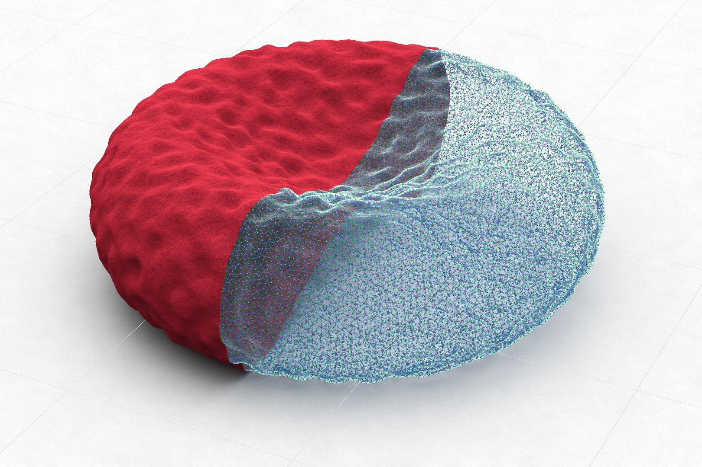

## OpenRBC

OpenRBC is a coarse-grained molecular dynamics code for simulating entire human red blood cells at the protein resolution. It is one of the winners in the IBM OpenPower Developer Challenge competition. The code outperforms a legacy solver by 10 times in time-to-solution through the use of an novel adaptive spatial searching algorithm to accelerate the computation of short-range pairwise interactions in an extremely sparse 3D space.

 [source](https://github.com/yhtang/OpenRBC)

